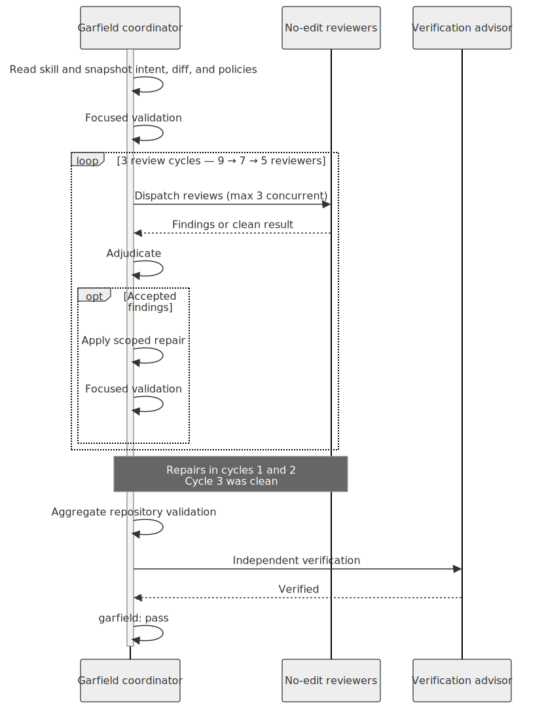
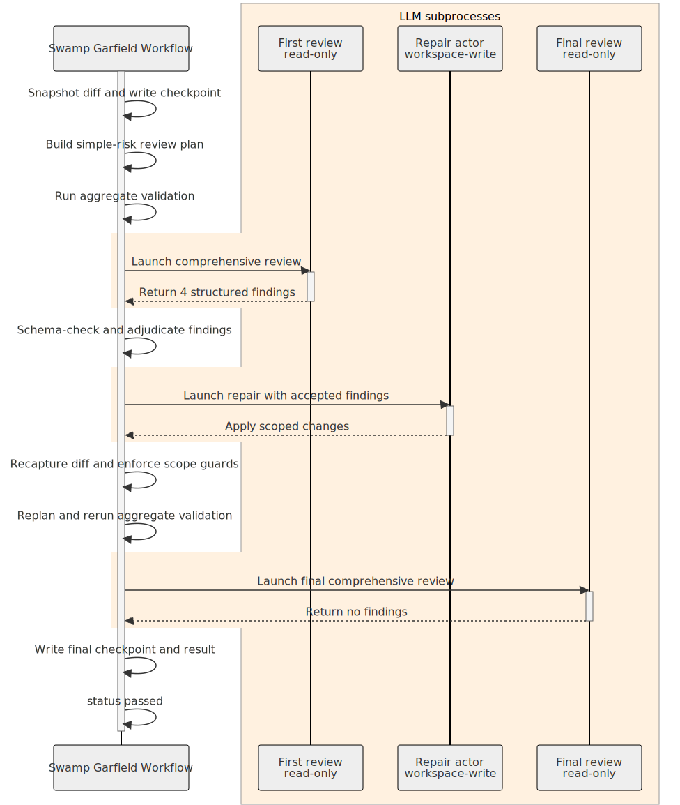

Embedding complex workflows and logic into AI Agents through skills alone is a dramatically inefficient way to work. By using a [swamp workflow](https://swamp-club.com) instead of the skill alone, I dropped the [token usage 8x, and decreased the run time by 2x](https://github.com/adamhjk/garfield-extension#result) for a complex code review workload. For a lot of use cases, it's the single best thing you can do to reduce your token spend.

## What Happened 

My (friend? acquaintance? long time social media conversationalist? Hi David!) [David Cramer](https://x.com/zeeg) of [Sentry](https://sentry.io) fame wrote a post titled ["We Cant Afford Your Inference"](https://x.com/zeeg/status/2076705916544848265). In it, he details how he spent north of $10,000 on tokens in a week, across multiple models and workloads. His conclusion was essentially: new models are too expensive to use broadly at Sentry:

> For Sentry I'm not really sure how we're going to approach this. We estimated an average spend of $1,000/week/developer, not $1,000/day. Fable is truly an impressive model, but it simply is not affordable to use when you pay for tokens. Sol is more approachable, but there appear to be enough footguns that we're amplifiying costs to an unsustainable degree (albeit GPT 5.5 was not that much better).

> I think the (near-term) future is faster and more affordable models, that bring this year's Opus-level intelligence to the masses. I dont need models to be coordinators when I can build that myself. I need the raw outputs to be better, I need them to sustainably fit in budgets, and I need them to be as fast as (and faster than) Composer.

He attributed a significant part of the spend to how the models ran his [Garfield skill](https://github.com/dcramer/agents/tree/main/skills/garfield) - which, in my words, not David's, is basically an adaptive code review framework designed to ensure coding policy was adhered to after an agent edits source code.

Here is how David's skill executed when I triggered it in Codex with a representative problem:



The Garfield skill used ~4.5 million tokens, ran for ~12 minutes, and used 23 total sub-agents. It used a coordinator agent to dispatch a rolling series of sub-agents to review the code according to the policy/standards in the repository. Each review cycle dispatched sub-agents to review the work, and passed their verdict back to the coordinator to adjudicate the findings. Then it ran one final verification pass to ensure the resulting code also passed things like tests, formatting, and lint.

What's great about Garfield as designed is that it uses the LLMs own intelligence to evaluate the code, then re-evaluate its own work, and ultimately to judge if it has achieved the outcome it wanted. It also will inspect the repository you use it in, discovering specific policy for that individual code base. This would have been essentially impossible to build even two years ago. It's miraculous in many ways.

It also uses a ton of tokens and wall-clock time, because it's asking a non-deterministic adjudicator to evaluate the results of other non-deterministic processes in order to perform all the work. It's the most expensive loop possible, basically, because it puts the LLM in the hot path, when in fact it doesn't need to be. My metaphor for this design is that it's using 100% of the possible intelligence to solve every part of the problem, even those that computers have been great at doing reliably since they were invented.

I was pretty sure I could dramatically alter the economics by translating his skill into a [swamp extension](https://swamp-club.com/extensions/@adam/garfield), keeping all the existing functionality intact. Here is what it looked like to get identical functionality, only with swamp:



The Garfield swamp workflow used ~500 thousand tokens, ran for ~6.5 minutes, and used 3 agents total. That's ~8x fewer tokens overall, and it cut the runtime in half. It built a [swamp extension](https://swamp-club.com/manual/reference/extensions) that turned the coordination workflow described in the skill into a single [swamp model type](https://swamp-club.com/manual/reference/extensions/model). The swamp model handles the work of the coordinating agent as deterministic code, farming out work to agents when we need their intelligence, and evaluating their work deterministically. It stores the results of each sub-agent as versioned, typed data - giving complete visibility into every step, and enabling sub-agents to see the past history of their own work (avoiding costly re-work cycles.) It also has a few optimizations that I couldn't resist - for example, it adds a risk review phase that slides the scale of how intense the review should be. But the vast majority of the savings was simply in removing the tax of the coordinator.

## How to do it yourself

### Step 0: Install swamp and initialize your swamp repo

To install swamp:

```
curl -fsSL https://swamp-club.com/install.sh | sh
```

Then I recommend going to the source code checkout where you have your current agent/skills implemented, and initializing it as a swamp repo:

```bash
$ swamp repo init --tool codex
```

The `--tool` option specifies which harnesses you are using - it helps the initialization process customize things like skills for particular harnesses.

:::tip
Make sure you create an account and login to [Swamp Club](https://swamp-club.com). It will help when you create your own extension later in step 2.
:::

### Step 1: Understand the current behavior

First, you need to gain an understanding of what the skill (or agent) is currently designed to do. Since I didn't write Garfield, my first move was to read the skill top to bottom myself. I made notes in my notebook (I always have a physical notebook at hand, because writing things down helps me internalize them) about the structure and how I thought it worked. Then I asked Codex:

```prompt
Read the garfield skill and summarize for me what it does, and how you are likely to interpret its instructions in practice. Draw ASCII diagrams to help me understand.
```

The results confirmed my own understanding of how Garfield worked in practice - it was a review-fix-verify loop for code that has already been implemented, where its role is to adjust the code to better fit the style and architecture of the code base itself. It doesn't do big refactors or propose large changes. 

If you already have a strong mental model of how the agent works currently (because, for example, you wrote it) - I would skip straight to just asking Codex or Claude to explain to you the current behavior. 

:::tip
If I already understood it, why did I ask the Agent to tell me about it? Because I needed that information in the *context window* for the translation. 
:::

### Step 2: Translate it to into a Swamp extension

Now that you have the context for the skill you want to optimize in your agent, ask it to translate that to a swamp workflow extension. 

```prompt
Translate the garfield skill into a swamp extension. The goal is to translate the behavior of the skill as directly as possible into deterministic code within swamp models and workflows. Start by building a comprehensive plan for me to review.
```

If this is your first time using Swamp, you likely won't have a lot of feedback about the swamp specific parts of the plan. That's okay! The thing to ensure is that the plan is an accurate reflection of the *outcome* you wanted from the skill you are translating. The swamp parts will take care of themselves.

Once you are happy with the plan, tell the agent to go and implement it for you! Do some manual testing, and make sure things work as expected - then lets measure our outcome.

### Step 3: Black box testing and measurement

The most valuable kind of testing you can do with AI is [black box user acceptance testing](https://stack72.dev/the-gate-between-our-agent-code-and-our-users/). It gives you a repeatable way to improve and refactor the code your agents produce, ensuring things don't regress. In a more intense project, I would recommend you do this step in a fully separate agent context (so that the agent can't modify its own UAT suite). But for a task like this one, it's enough to just write the suite in the first place - since you're unlikely to need it long term. 

Combine asking the agent to write the black box test suite with measuring the impact across both the original skill and the swamp workflow that replaces it:

```prompt
Write a black box user acceptance test that runs both the existing skill and the new swamp workflow. Measure their performance, token usage, and execution time. The test suite should report their success or failure to perform real world tasks, and tell me the level of improvement between the existing skill and the swamp workflow.
```

You can see the results of this prompt in the [garfield extension repository](https://github.com/adamhjk/garfield-extension/tree/main/benchmarking) - it built a benchmarking suite, a test code base, and the tests themselves. Being able to write comprehensive testing and validation is a super power of AI agents - don't sleep on it.

Here was the result of the Garfield tests:

| Case                  | Treatment           | Graded | Tree tokens | Agents | Wall     |
| --------------------- | ------------------- | ------ | ----------: | -----: | -------: |
| `contained-dry-run`   | `garfield`          | pass   |   4,639,565 |     23 | 12.8 min |
| `contained-dry-run`   | `workflow-garfield` | pass   |     506,484 |      3 |  6.6 min |
| `payment-idempotency` | `garfield`          | fail   |  12,277,282 |     45 | 30.2 min |
| `payment-idempotency` | `workflow-garfield` | fail   |   1,570,242 |      6 | 10.5 min |

Interestingly it discovered a common failure case - when a problem was present in a complex diff, it was often undiscovered within the bounds of Garfields explicit budgets. In the garfield skill case, it failed *open* - it declared the work a success while leaving the defect present. The workflow failed *closed* - it reported the fact that findings remained after the limit on the number of actors was reached.

### Step 4: Refactor and Refine

Which brings us to the last step - refactoring and refining. If I was actually planning to use Garfield, I would take the results of the black box testing and refine the workflow further. Closing off the issue with unresolved findings would be top of my list, but I would also add more use cases to the mix, and determine if the workflow handled them gracefully.

This stage is another welcome benefit of using Swamp to build your agent systems: it's easy to refactor swamp models and workflows, because they are "normal" deterministic code. Embrace the refactoring loop. Get a working version, measure it, and refactor until it performs in acceptable bounds. Like any other piece of software, you can measure it, and then improve it.

:::tip
One of the most common failure modes of folks just getting started with AI agents is the desire for things to work perfectly the first time. Just like when people wrote the code, they won't. [You still have to refactor, even when you use AI](https://www.adamhjk.com/blog/you-still-have-to-refactor-even-with-ai/). 
:::

## Why it works

[Swamp](https://swamp-club.com) provides [the primitives](https://swamp-club.com/manual/explanation/how-swamp-works) that allow agents to effectively build an adaptive model of the problem at hand, and then evolve it over time. By having your agents solve problems for you by building typed models and store the information about what they produce as typed, versioned data - you focus your usage of the most expensive part of the system (the LLM) where it gives you the most value. It moves the logic that must be deterministic (which is almost all of it) into reusable building blocks, and then slots intelligence in where you need it.

You use the Agent to build the program that minimizes the need for the Agent itself.
